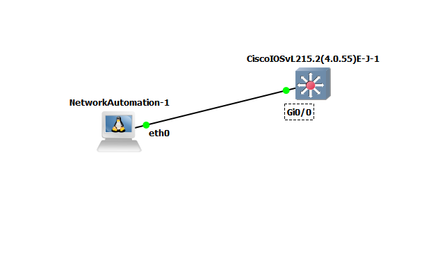

# AutoSwitchConf
**AutoSwitchConf** is python utility to get the configuration of a cisco switch using telnet

## Functions
Currently implemented function is to connect to the switch and get the interfaces and their status

For example


### Usage

edit the /settings/switch.py file to provide the IP of the switch and telnet password an then run the following command from the network automation controller


``` 
python3 main.py
```


Mockup of the connections in gns3

---



## TO DO

- [ ] Check the running-config and download if new. Log the activity
- [ ] Check the startup-config and download if new. Log the activity
- [ ] Inventory the hardware components and versions and record
- [ ] Inventory the interfaces and record their configuration
- [x] Inventory the interfaces and record their status
- [ ] Inventory the VLANs on a switch and identify if VTP is running
- [ ] Document the STP status and mitigate
- [ ] Identify the access port configurations and mitigate
- [ ] Identify the trunk port configurations and mitigate
